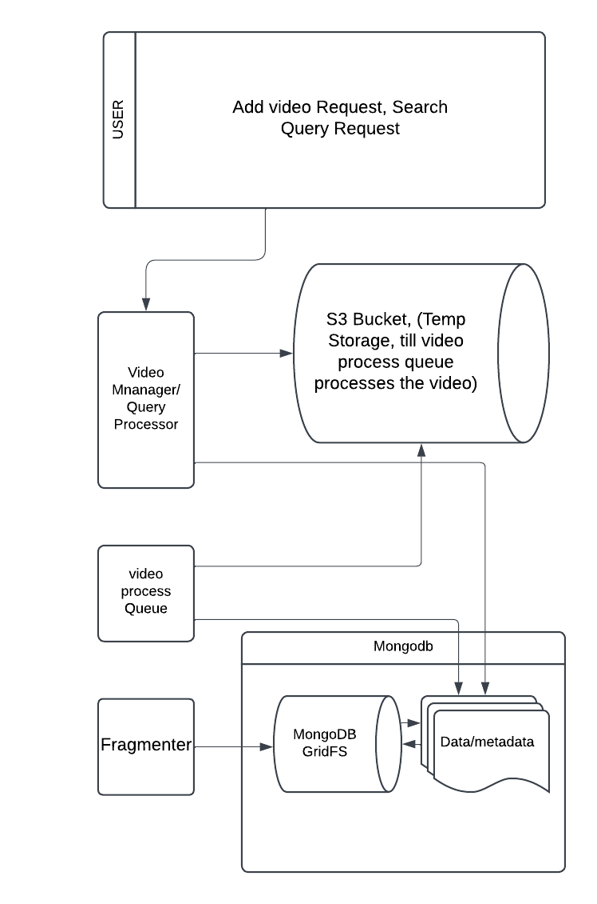
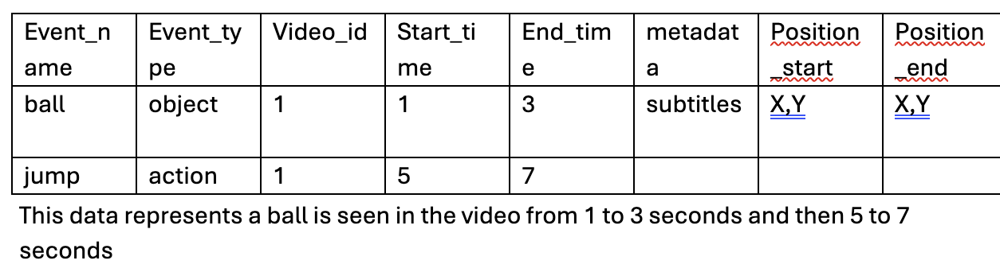
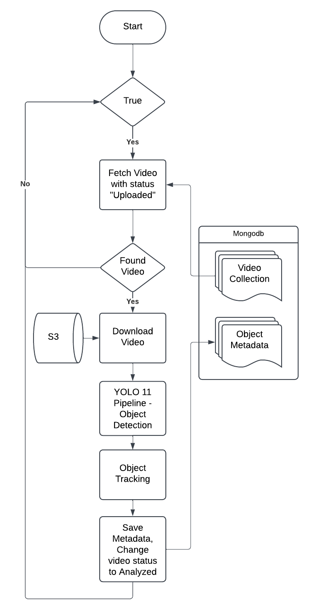
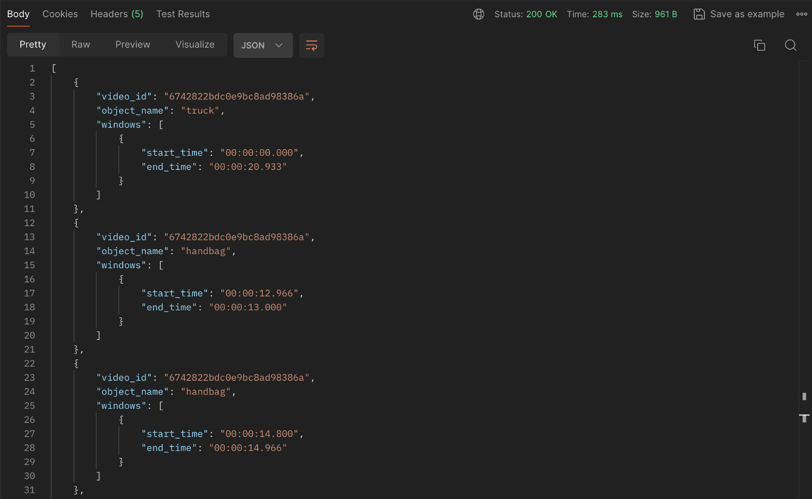
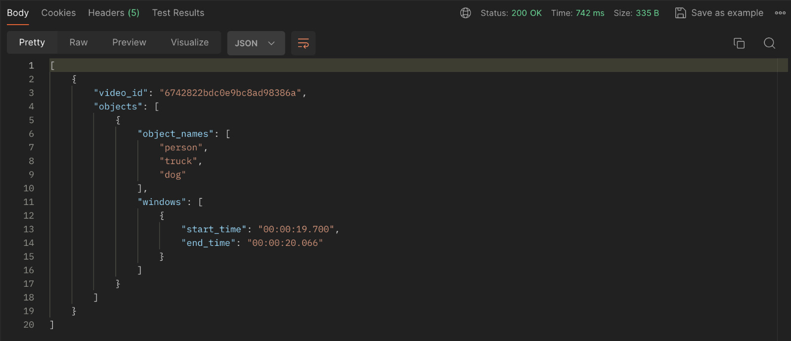
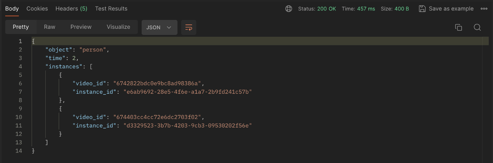
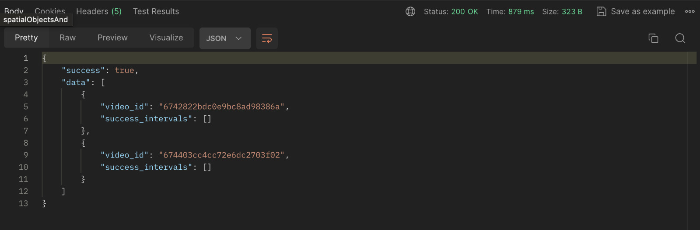
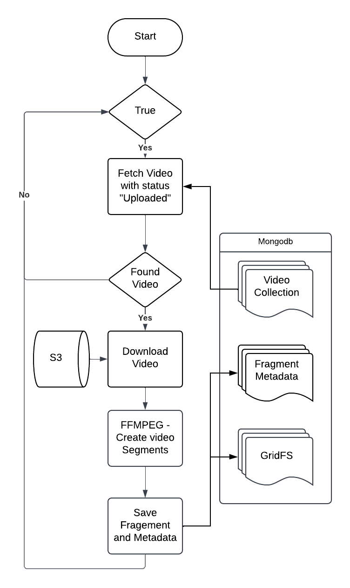

# Advanced Video Querying System for Machine Learning Applications

## Overview
This project presents a novel video querying system that addresses the challenges of processing and analyzing large-scale video datasets. Leveraging advanced object detection and metadata generation techniques, the system enables precise spatial-temporal queries and supports complex multi-object interactions, significantly enhancing workflows for machine learning and data analysis.



---

## Features
- **Precise Spatial and Temporal Querying:** Query objects based on spatial coordinates and specific timestamps.
- **Multi-Object Interaction Detection:** Detect interactions such as objects nearby or specific movement patterns.
- **Efficient Data Filtering:** Extract only relevant video segments, reducing computational resources for machine learning workflows.
- **Advanced Object Detection:** YOLOv11 with transformer-based enhancements for robust and accurate object detection.
- **Chunk-Based Video Management:** Videos are divided into manageable 5-second chunks stored efficiently in MongoDB GridFS.



---

## Table of Contents
- [Introduction](#introduction)
- [System Workflow](#system-workflow)
- [Key Features](#key-features)
- [Query Types](#query-types)
- [Installation](#installation)
- [Usage](#usage)
- [Challenges and Limitations](#challenges-and-limitations)
- [Future Work](#future-work)
- [Acknowledgments](#acknowledgments)

---

## Introduction
The rapid growth of video datasets, such as YouTube-8M, has created significant challenges for machine learning engineers. Processing entire datasets for AI model training is resource-intensive and often impractical. Existing solutions lack the sophistication needed for precise spatial-temporal querying and advanced multi-object detection. This project introduces a scalable and efficient querying system to address these gaps.

## System Workflow
The system integrates video ingestion, object detection, metadata generation, and querying:
1. **Video Ingestion:** Users upload videos via APIs, which are pre-processed and fragmented for efficient storage.
2. **Object Detection:** YOLOv11 detects objects, generates bounding boxes, and extracts spatial-temporal metadata.
3. **Metadata Storage:** Metadata is stored in MongoDB for fast querying.
4. **Query Engine:** Users perform complex queries through a RESTful API.
5. **Video Retrieval:** The system returns specific video chunks or frames matching the query.



---

## Key Features
### Customizable Spatial-Temporal Queries
- Example: "Find moments when a car enters the top-left quadrant between 2 and 3 minutes."

### Multi-Object Interaction Detection
- Example: "Identify all moments when a person and a bicycle are within 10 pixels of each other."

### Context-Based Spatial Region Queries
- Example: "Detect a person entering the bottom-right quadrant and staying there for 5 seconds."

### Efficient Indexing
- Uses spatial (R-trees) and temporal (B-tree) indexing for fast data retrieval.

---

## Query Types
### Spatial Object Queries
Find objects within specific spatial regions:
```bash
/query/spatialObjects?objects=["truck","handbag"]&area=left-half
```


### Spatial Objects AND Query
Identify simultaneous presence of multiple objects in a specified area:
```bash
/query/spatialObjectsAnd?objects=["person","truck","dog"]&area=left-half
```


### Temporal Queries
Retrieve instances of objects at specific timestamps:
```bash
/query/queryInstancesAtTime?object=person&time=2
```


### Instance Overlaps in Area
Identify multiple instances of the same object class within a specific area:
```bash
/query/queryInstanceOverlapsInArea?object=person&count=2&area=top-right
```


---

## Installation
1. Clone the repository:
   ```bash
   git clone https://github.com/vikasdimaniya/VidMetaStream.git
   cd VidMetaStream
   ```

2. Install dependencies:
   ```bash
   pip install -r requirements.txt
   npm ci
   ```

3. Set up MongoDB and FFmpeg.

---

## Usage
1. **Upload Videos:**
   Use the provided API to upload videos and generate metadata.
   ```bash
   POST /upload
   ```

2. **Perform Queries:**
   Example query for spatial objects:
   ```bash
   GET /query/spatialObjects?objects=["truck"]&area=left-half
   ```

3. **Download Video Chunks:**
   Use the API to download relevant video segments.

---

## Challenges and Limitations
### Challenges
- Transitioning from TransVOD++ to YOLOv11.
- Managing large datasets efficiently in MongoDB GridFS.

### Limitations
- Limited object detection to predefined classes in COCO dataset.
- Absence of real-time updates and parallel model integration.

---

## Future Work
1. **Scene-Text Grounding:** Automating text recognition within frames for semantic searches.
2. **Parallel Model Integration:** Allowing concurrent use of multiple models.
3. **Advanced Indexing:** Enhancing spatial and temporal indexing to accelerate complex queries.

---

## Acknowledgments
Special thanks to:
- YOLOv11 team for their transformer-based advancements.
- MongoDB for providing scalable storage solutions.
- FFmpeg for its reliable video processing tools.



---

Enjoy exploring your video datasets!
